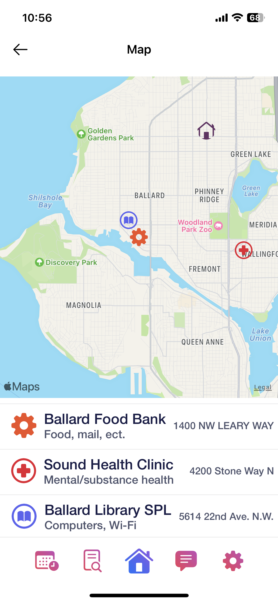

<h1 align="center">Food&Share</h1>

  

Created By

  <strong style="font-size: 20px">Ian Holloway</strong>
    
  <strong style="font-size: 20px">& Ben Roberts<strong>
    

# Awards

<h3><a href="https://www.congressionalappchallenge.us/21-WA07/">Congressional App Challenge WA07 Winner 2021</a> - Food&Share was awarded as the best app by Congresswoman Pramila Jayapal <h3>

# Backend

This app uses Firebase to store data from surveys and the user account data. This allows staff at the food bank to sign in to the app to make changes to information like survey questions.

# Frontend

<h2>Homepage</h2>

<h2>Calender</h2>

<h2>Map</h2>

<h2>Surveys</h2>

